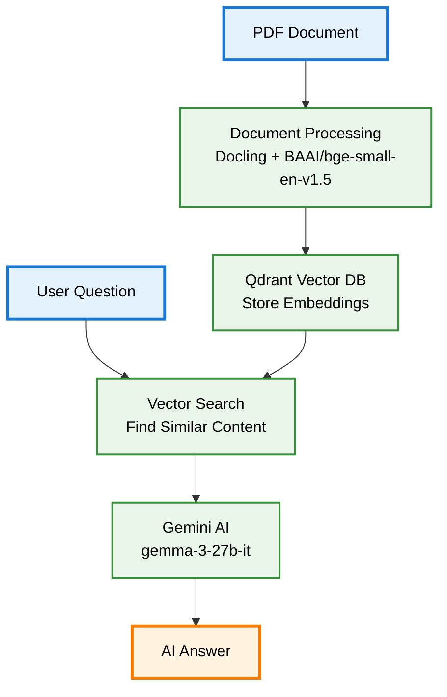

# RAG Chatbot with Qdrant, Gemma3, and Docling

This chatbot answers questions about your documents using Retrieval-Augmented Generation (RAG). Simply upload a PDF and start chatting! Inspired by Sabrina Aquino, this version offers a more structured approach with runnable scripts.

## Features

- Load and process PDF documents
- Smart document search and retrieval
- Interactive chat interface
- Powered by Google Gemini AI
- Easy setup and use
## Architecture 

## Project Structure

```
rag-chatbot/
├── main.py              # Main script to run
├── chatbot.py           # RAG chatbot logic
├── config.py            # Configuration settings
├── document_processor.py # PDF processing
├── vector_store.py      # Document storage
├── requirements.txt     # Dependencies
├── setup.py            # Setup script
├── .env                # Your API key (create this)
└── data/               # Your documents go here
``` 
## Quick Start

### 1. Setup Environment

```bash
# Clone or download this project
# Navigate to the project folder

# Create virtual environment
python -m venv venv

# Activate it
# Windows:
venv\Scripts\activate
# Mac/Linux:
source venv/bin/activate

# Install dependencies
pip install -r requirements.txt
```

### 2. Get API Key

1. Go to [Google AI Studio](https://makersuite.google.com/app/apikey)
2. Create a new API key
3. Create a `.env` file in the project folder:
> You can use .env.example as a template 
```
GEMINI_API_KEY=your_api_key_here
```

### 3. Add Your Document

```bash
# Create data folder
mkdir data

# Put your PDF in the data folder
# Example: data/my_document.pdf (e.g., your resume for quick testing)
```

### 4. Run the Chatbot

```bash
# Interactive chat mode
python main.py --document data/my_document.pdf

# Or use the default document path
python main.py
```

## Usage Examples

### Interactive Mode
```bash
python main.py --document data/rust_book.pdf
```
Then type your questions:
```
👤 You: What is ownership in Rust?
🤖 Bot: Ownership is a key concept in Rust...
```

### Single Question Mode
```bash
python main.py --document data/rust_book.pdf --query "What is a variable?"
```

### Check Status
```bash
# In interactive mode, type:
status
```

## Commands

- `status` - Show chatbot info
- `help` - Show available commands  
- `quit`, `exit`, or `q` - Exit the chatbot


## What to Expect After Running

### Running Locally

Keep in mind that running the scripts locally can take some time. The duration depends on factors like file size, connection speed, and your computer's performance.

If you're still up for it, here's what you can expect:


For example, if you upload your resume and ask a simple question, you might see something like this:


### Running on Colab

Here's an example of the output you might see when running on Colab:


If you use your resume (like mine, for example):


If you're using a different PDF, you can run a command like this:

```bash
!python main.py --document /content/rust_book.pdf
```

> Note: This might take a while, especially since the book we are using [Rust book](https://www.scs.stanford.edu/~zyedidia/docs/rust/rust_book.pdf) is 670 pages long!

### Running the Notebook on Colab (Recommended)

For a complete walkthrough and example outputs, check out this [tutorial](https://github.com/sabrinaaquino/rag_chatbot/blob/main/simple_rag_ai_chatbot.ipynb) by Sabrina Aquino.


## Troubleshooting

### Common Issues

**"GEMINI_API_KEY not found"**
- Make sure you created the `.env` file
- Check that your API key is correct

**"Document not found"**
- Make sure your PDF is in the `data/` folder
- Check the file path is correct

**"Module not found"**
- Make sure you activated your virtual environment
- Run `pip install -r requirements.txt` again

**"Model not available"**
- The Gemini model might not be available in your region
- Check Google AI Studio for available models

### Need Help?

1. Make sure Python 3.8+ is installed
2. Check that all dependencies are installed
3. Verify your API key is valid
4. Ensure your document is a readable PDF

## Configuration

You can modify settings in `config.py`:

- `MAX_TOKENS`: Chunk size for document processing
- `RETRIEVAL_LIMIT`: Number of relevant chunks to retrieve
- `GEMINI_MODEL`: AI model to use


## License

This project is open source. Feel free to modify and use it!

---

Happy chatting!
